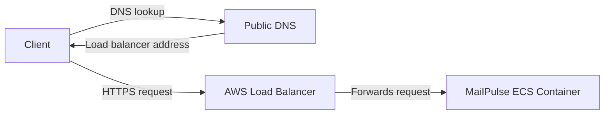

# MailPulse

MailPulse is a backend tool that checks whether a mail server and domain are set up so incoming mail can be delivered.

It came out of a real incident: my mail server failed without me noticing. For several days, messages to my domain were not delivered, and I missed important email. MailPulse is meant to surface that kind of failure early, before silent delivery loss drags on.

The goal is for this API to become a small suite of automation-friendly tools for confirming mail server health.

**Live API**: [https://mailpulse.aminbeigi.com/api/v1/docs](https://mailpulse.aminbeigi.com/api/v1/docs)

## API


| Endpoint                   | Description                           |
| -------------------------- | ------------------------------------- |
| `GET /api/v1/health`       | Health check.                         |
| `GET /api/v1/mail-health`  | Mail server and domain health checks. |
| `GET /api/v1/docs`         | Swagger UI.                           |
| `GET /api/v1/openapi.json` | OpenAPI schema.                       |


## Mail Health

`GET /api/v1/mail-health` runs nine DNS and WHOIS checks against a domain. Each check has a `severity` of `critical` or `warning`. The top-level `status` is `healthy` only when every emitted **critical** check passes; warning failures are included in the response but do not change the verdict.

| Severity | Checks |
| -------- | ------ |
| `critical` | MX records present, not a null MX, MX target is a hostname, MX target is not a CNAME, top MX resolves |
| `warning` | Multiple MX records, SPF record at apex, DMARC record published, domain registration not expiring soon |

The WHOIS expiry check (`domain_not_expiring_soon`) is omitted from the response when WHOIS data is unavailable for a TLD.

Example response:

```json
{
  "domain": "example.com",
  "status": "healthy",
  "checks": [
    {
      "name": "mx_records_found",
      "title": "MX records present",
      "description": "Confirms the domain publishes at least one DNS MX record...",
      "reference": "RFC 5321",
      "severity": "critical",
      "passed": true,
      "result": "2 MX record(s): 10 mx1.example.com, 20 mx2.example.com"
    },
    {
      "name": "spf_record_present",
      "title": "SPF record at apex",
      "description": "Checks for a TXT record at the domain apex beginning with v=spf1...",
      "reference": "RFC 7208",
      "severity": "warning",
      "passed": false,
      "result": "No v=spf1 TXT record at apex"
    }
  ]
}
```

A `"status": "healthy"` result with a failed warning check (like the SPF example above) means all critical delivery infrastructure is in place, but the recommended authentication record is missing.

## Architecture

MailPulse is stateless: the API keeps no server-side sessions, in-memory user state, or local database. Each request is handled on its own, so any healthy ECS task behind the load balancer can serve any call.

At a high level, the client asks DNS for `mailpulse.aminbeigi.com`, DNS returns the load balancer address, the client connects to the load balancer, and the load balancer forwards the request to the MailPulse container.



### SMTP Limitation

The production API runs in an AWS ECS container. AWS blocks outbound TCP connections to port 25 from that container, so MailPulse cannot connect to remote SMTP servers, open SMTP handshakes, or verify live SMTP reachability in production.

`GET /api/v1/mail-health` therefore reports DNS and WHOIS based health only. A `"healthy"` result means the domain is configured plausibly for inbound mail, not that a live SMTP server is accepting mail.


## Local Development

Clone the repo and work on MailPulse locally: install dependencies, run the API, test, and lint.

### Requirements

- Python 3.12+
- [Git](https://git-scm.com/)
- [uv](https://docs.astral.sh/uv/getting-started/installation/)
- [Docker](https://docs.docker.com/get-docker/)

### Setup

```bash
git clone https://github.com/aminbeigi/mailpulse.git
cd mailpulse

# Install dependencies, including dev tools, into a managed .venv.
uv sync --group dev

# Copy the example env file and adjust as needed.
cp .env.example .env
```

### Run

```bash
uv run python -m mailpulse
```

The server starts at `http://127.0.0.1:8000` by default. Local development exposes the same routes as production.

### Docker

Build and run the API in a container. The image sets `MAILPULSE_HOST=0.0.0.0` so the server accepts connections from outside the container.

```bash
docker build -t mailpulse:latest .
docker run --rm -d --name mailpulse -p 8000:8000 mailpulse:latest
curl http://127.0.0.1:8000/api/v1/health
```

### Configuration

All settings are read from environment variables, or from a `.env` file, with the `MAILPULSE_` prefix.


| Variable             | Default     | Description          |
| -------------------- | ----------- | -------------------- |
| `MAILPULSE_HOST`     | `127.0.0.1` | Bind host.           |
| `MAILPULSE_PORT`     | `8000`      | Bind port.           |
| `MAILPULSE_RELOAD`   | `false`     | Enable hot reload.   |
| `MAILPULSE_APP_NAME` | `MailPulse` | Application name.    |
| `MAILPULSE_VERSION`  | `1.0.0`     | Application version. |


### Tests

Automated tests live in the top-level `tests/` directory. They use [pytest](https://docs.pytest.org/) with FastAPI's test client via [httpx](https://www.python-httpx.org/).

Run the full suite:

```bash
uv run pytest
```

Run a single file or test:

```bash
uv run pytest tests/test_health.py
uv run pytest tests/test_health.py::test_health_returns_ok
```

### Lint And Format

```bash
# Check for issues.
uv run ruff check mailpulse

# Auto-fix issues.
uv run ruff check --fix mailpulse

# Format code.
uv run ruff format mailpulse
```

### Pre-Commit

```bash
# Install hooks. Run once after cloning.
uv run pre-commit install

# Run hooks manually against all files.
uv run pre-commit run --all-files
```

## CI/CD

GitHub Actions keeps CI and deployment separate.

### CI

The CI workflow in `.github/workflows/ci.yml` runs on every pull request and push to `main`:

1. Lint with Ruff.
2. Run tests with pytest.
3. Verify the Docker image builds.

Nothing is published or deployed during CI.

### Deployment

Deployment is manually triggered from the GitHub Actions tab by `.github/workflows/deploy.yml`. It builds the current commit, pushes the image to Amazon ECR with the commit SHA tag, updates the ECS task definition to use that image, and rolls out the new revision to the ECS service.

AWS credentials and ECR/ECS deployment configuration are supplied through GitHub repository secrets.

## Project Structure

```text
mailpulse/
|-- __init__.py              # Package version
|-- __main__.py              # Entry point: python -m mailpulse
|-- app.py                   # FastAPI app factory
|-- api/
|   |-- router.py            # Mounts routes under /api/v1
|   `-- routes/
|       |-- health.py        # GET /api/v1/health (load balancer liveness)
|       `-- mail_health.py   # GET /api/v1/mail-health
|-- core/
|   |-- config.py            # Settings via pydantic-settings
|   `-- helper.py            # Email/domain input validation
|-- schemas/
|   |-- health.py            # Liveness response model
|   `-- mail_health.py       # Mail-health response models (checks, severity)
`-- services/
    |-- mail_health.py           # DNS/WHOIS probes and check orchestration
    `-- mail_health_catalog.py   # Static check metadata and result templates
tests/
|-- test_domains.py        # resolve_domain_input validation
|-- test_health.py         # GET /api/v1/health
`-- test_mail_health.py    # GET /api/v1/mail-health
```

## Author

Amin Beigi.

## License

This project is licensed under the MIT License.
See [LICENSE](LICENSE) for the full text.