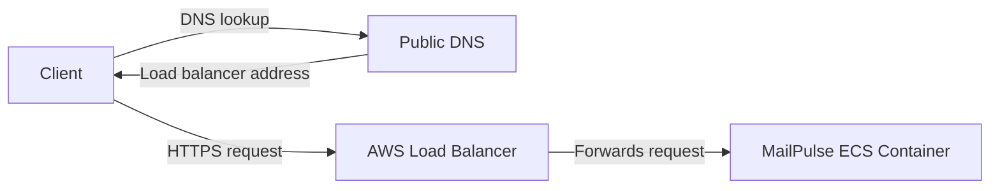

<p align="center">
  
  <br/>
  <h3 align="center">MailPulse</h3>
</p>
<br />

<p align="center">
  <a href="../../issues"></a>
  <a href="../../pulls"></a>
  
</p>


# Description

MailPulse is a REST API that checks whether a mail server and domain are set up so incoming mail can be delivered.

It came out of a real incident: my mail server failed without me noticing. For several days, messages to my domain were not delivered, and I missed important email. MailPulse is meant to surface that kind of failure early, before silent delivery loss drags on.

The goal is for this API to become a small suite of automation-friendly tools for confirming mail server health.

**Live API**: [https://mailpulse.aminbeigi.com/api/v1/docs](https://mailpulse.aminbeigi.com/api/v1/docs)

## Getting Started

These instructions will get you a copy of the project up and running on your local machine for development and testing purposes. See [Deployment](#deployment) for notes on how to deploy the project on a live system.

### Prerequisites

- [Git](https://git-scm.com/downloads) — clones the repository
- [Docker](https://docs.docker.com/get-docker/) — builds and runs the API
- [uv](https://docs.astral.sh/uv/) — installs dependencies for tests and lint

### Installation

**1. Clone the repository**

```bash
git clone https://github.com/aminbeigi/mailpulse.git
cd mailpulse
```

**2. Install dependencies**

```bash
uv sync --group dev
```

**3. Configure environment**

```bash
cp .env.example .env
```

**4. Install Git hooks**

```bash
uv run pre-commit install
```

**5. Build the image**

```bash
docker build -t mailpulse:latest .
```

**6. Run the API**

```bash
docker run --rm -d --name mailpulse -p 8000:8000 mailpulse:latest
```

**7. Try it**

```bash
curl "http://127.0.0.1:8000/api/v1/mail-health?domain=example.com"
```

**8. Stop the container**

```bash
docker stop mailpulse
```

## Running the tests

Run the full suite:

```bash
uv run pytest
```

Run a single file or test:

```bash
uv run pytest tests/test_health.py
uv run pytest tests/test_health.py::test_health_returns_ok
```

## Lint And Format

```bash
# Check for issues.
uv run ruff check mailpulse

# Auto-fix issues.
uv run ruff check --fix mailpulse

# Format code.
uv run ruff format mailpulse
```

## CI/CD

GitHub Actions keeps CI and deployment separate.

### CI

The CI workflow in `.github/workflows/ci.yml` runs on every pull request and push to `main`:

1. Lint with Ruff.
2. Run tests with pytest.
3. Verify the Docker image builds.

Nothing is published or deployed during CI.

### Deployment

Deployment is manually triggered from the GitHub Actions tab by `.github/workflows/deploy.yml`. It builds the current commit, pushes the image to Amazon ECR with the commit SHA tag, updates the ECS task definition to use that image, and rolls out the new revision to the ECS service.

AWS credentials and ECR/ECS deployment configuration are supplied through GitHub repository secrets.

## API Specification

| Endpoint                   | Description                           |
| -------------------------- | ------------------------------------- |
| `GET /api/v1/health`       | Health check                          |
| `GET /api/v1/mail-health`  | Mail server and domain health checks  |
| `GET /api/v1/docs`         | Swagger UI                            |
| `GET /api/v1/openapi.json` | OpenAPI schema                        |

## Architecture

MailPulse is stateless: the API keeps no server-side sessions, in-memory user state, or local database. Each request is handled on its own, so any healthy ECS task behind the load balancer can serve any call.

At a high level, the client asks DNS for `mailpulse.aminbeigi.com`, DNS returns the load balancer address, the client connects to the load balancer, and the load balancer forwards the request to the MailPulse container.



### SMTP Limitation

The production API runs in an AWS ECS container. AWS blocks outbound TCP connections to port 25 from that container, so MailPulse cannot connect to remote SMTP servers, open SMTP handshakes, or verify live SMTP reachability in production.

`GET /api/v1/mail-health` therefore reports DNS and WHOIS based health only. A `"healthy"` result means the domain is configured plausibly for inbound mail, not that a live SMTP server is accepting mail.

## Author

- Amin Beigi

## License

This project is licensed under the MIT License.  
See [LICENSE](LICENSE) for the full text.