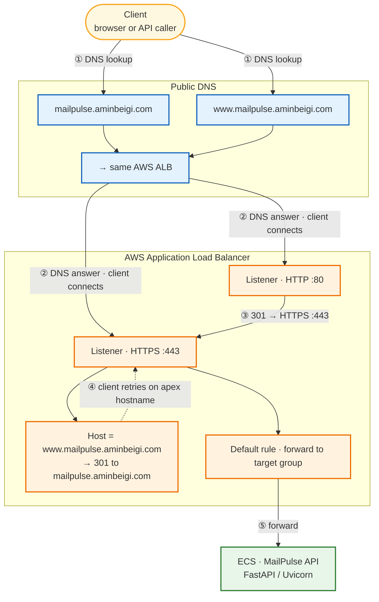

# MailPulse

MailPulse is a backend tool that checks whether your **mail server** and domain are set up so incoming mail can be delivered.

It came out of a real incident: my mail server failed without me noticing. For several days, messages to my domain were not delivered, and I missed important email. That kind of sucked...

MailPulse is meant to surface that kind of failure early, before silent delivery loss drags on.

I plan to add a bunch of useful endpoints in this API that I can use in my automations. I envision this repo to be sort of be like a suite of tools for confirming mail server health.

The app is hosted at [https://mailpulse.aminbeigi.com](https://mailpulse.aminbeigi.com). 
To get started, open the API docs at [https://mailpulse.aminbeigi.com/api/v1/docs](https://mailpulse.aminbeigi.com/api/v1/docs).

## Requirements

- Python 3.12+
- [uv](https://docs.astral.sh/uv/getting-started/installation/)

## Setup

```bash
# Install dependencies (including dev tools) into a managed .venv
uv sync --group dev

# Copy the example env file and adjust as needed
cp .env.example .env
```

## Run

```bash
uv run python -m mailpulse
```

The server starts at `http://127.0.0.1:8000` by default.

## Tests

Automated tests live in the top-level `tests/` directory (for example `tests/test_health.py`). They use [pytest](https://docs.pytest.org/) together with FastAPI’s test client (via [httpx](https://www.python-httpx.org/)).

Run the full suite:

```bash
uv run pytest
```

Run a single file or test:

```bash
uv run pytest tests/test_health.py
uv run pytest tests/test_health.py::test_health_returns_ok
```

## Docker

Build and run the API in a container (the image sets `MAILPULSE_HOST=0.0.0.0` so the server accepts connections from outside the container):

```bash
docker build -t mailpulse:latest .

docker run --rm -p 8000:8000 mailpulse
```


| Endpoint                   | Description                                 |
| -------------------------- | ------------------------------------------- |
| `GET /api/v1/health`       | Health check                                |
| `GET /api/v1/mail-health`  | Mail-receiving health for an email’s domain |
| `GET /api/v1/docs`         | Swagger UI                                  |
| `GET /api/v1/openapi.json` | OpenAPI schema                              |


## Configuration

All settings are read from environment variables (or a `.env` file) with the `MAILPULSE_` prefix:


| Variable             | Default     | Description         |
| -------------------- | ----------- | ------------------- |
| `MAILPULSE_HOST`     | `127.0.0.1` | Bind host           |
| `MAILPULSE_PORT`     | `8000`      | Bind port           |
| `MAILPULSE_RELOAD`   | `false`     | Enable hot-reload   |
| `MAILPULSE_APP_NAME` | `MailPulse` | Application name    |
| `MAILPULSE_VERSION`  | `0.1.0`     | Application version |


## Lint & Format

```bash
# Check for issues
uv run ruff check .

# Auto-fix issues
uv run ruff check --fix .

# Format code
uv run ruff format .
```

## Pre-commit

```bash
# Install hooks (run once after cloning)
uv run pre-commit install

# Run hooks manually against all files
uv run pre-commit run --all-files
```

## Project structure

```
mailpulse/
├── __init__.py
├── __main__.py        # Entry point: python -m mailpulse
├── app.py             # FastAPI app factory
├── api/
│   ├── router.py      # Aggregates all route modules
│   └── routes/
│       ├── health.py  # GET /api/v1/health
│       └── mail_health.py  # GET /api/v1/mail-health
├── core/
│   └── config.py      # Settings via pydantic-settings
├── schemas/           # Pydantic request/response models
│   └── mail_health.py
└── services/          # Business logic
    └── mail_health.py
tests/
├── test_health.py     # Example API test (GET /api/v1/health)
└── test_mail_health.py  # GET /api/v1/mail-health
```

## Architecture

MailPulse is **stateless**: the API keeps no server-side sessions, in-memory user state, or local database. Each request is handled on its own, so any healthy ECS task behind the load balancer can serve any call.

Traffic flow:

1. The client looks up **public DNS** for `mailpulse.aminbeigi.com` or `www.mailpulse.aminbeigi.com` (both names point at the same AWS ALB).
2. DNS returns the ALB endpoint; the client connects there.
3. HTTP on port **80** is redirected to HTTPS on port **443**.
4. On HTTPS, if the `Host` is `www.mailpulse.aminbeigi.com`, the ALB responds with a **301** to `mailpulse.aminbeigi.com`; otherwise the request is **forwarded** to MailPulse on ECS.




## Author
Amin Beigi (yours truly)

## License

This project is licensed under the MIT License. See [LICENSE](LICENSE) for the full text.